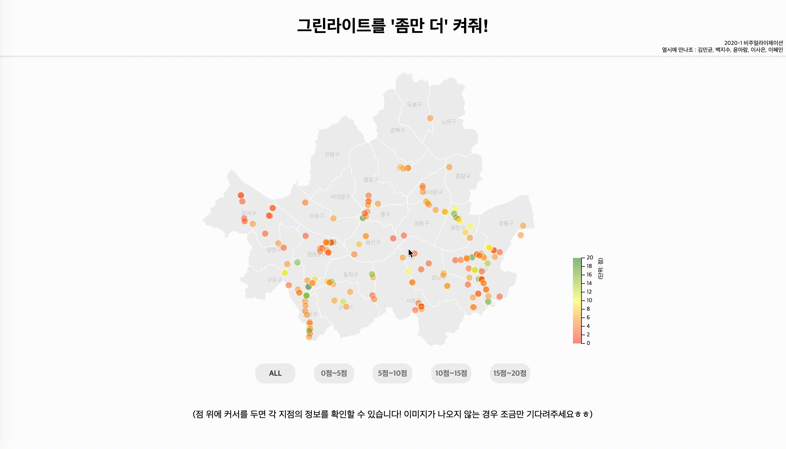

# Greenlight
[2020-1 비주얼라이제이션 데이터 시각화 프로젝트] 그린라이트를 좀만 더 켜줘!

### 프로젝트 진행
- 서울시에 횡단보도 데이터(번호, 교차로 명, 위치, 보행시간, 횡단길이 등)를 요청
- 대한공간정보학회지의 2015년 연령별 보행속도 연구 결과를 활용하여 각 횡단보도의 점멸 시간 적합도를 판단
- R을 통한 각각 횡단보도에 대한 데이터 전처리와 차트 구현
- d3.js로 서울시 지도 시각화 후 각각의 횡단보도 점으로 표시, 점을 hover하면 우측에 해당 횡단보도의 정보 확인
- 이미지 자료로 저널리즘 웹사이트 제작

### 기술 스택
- FE : HTML5, CSS3, d3.js
- BE : django

<a href='http://hyemmie.pythonanywhere.com/'>

#### 전체 페이지

#### 점수별 횡단보도 분류

#### 각 횡단보도의 연령별 보행 적합도 차트

